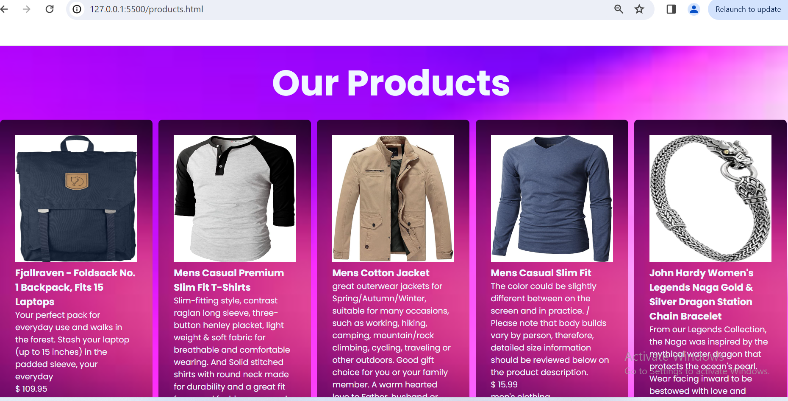

# Project Title: Pixel Pioneers E-commerce Webpage

This is a project simulating an e-commerce webpage, populated by an API

## Table of Contents

- [Project-Description](#Project-description)
- [Project Structure](#Project-Structure)
- [Screenshot](#Screenshot)
- [Links](#Links)
- [Built with](#Built-with)
- [What we learned](#What-we-learned)
- [Continued development](#continued-development)
- [Author](#Author)
- [Acknowledgement](#Acknowledgement)

# Project Description

Welcome to Pixels Pioneers, your go-to destination for cutting-edge technology!
This two-page E-commerce site is designed to provide users with a seamless and efficient shopping experience,
focusing on a curated selection of top-notch products including gadgets, jewelry and clothing.
The project provides optimal layout for all screen sizes, hover states can be seen in all links. The json files are populated by a Web API.

## Project Structure

Here's a quick overview of the project structure:

- index.html: The main page of the website, providing information about the products offered by Pixels Pioneers
- products.html: The next page that showcases the products available for sale in the company.
- category.html: This page filters the products available for sale by several categories and shows them to the user.
- landingpage.css: This css file styles the main page of the website.
- products.css: The css file styles the products page of the website.
- category.css: This css file is styles the category page of the website.
- script.js: This populates the products page.
- category.js: This populates the category page
- Images/: A directory containing images used in the project.
- Readme.md: This documentation file.

## Screenshot

- Here is the screenshot to the Main Page:
  
- Here is the screenshot to the Product Page:
  

## Built With

- Semantic HTML5 markup
- CSS custom properties
- Flexbox
- CSS Grid
- Mobile-first workflow

## What we Learned

- In this project, we collectively acquired valuable web development skills, with a particular emphasis on HTML, CSS flexbox, javascript and web responsveness. This experience deepened our understanding of structuring web pages and enhancing their visual appeal through effective CSS application, contributing to our overall growth in the field.

## Continued Development

- CSS flexbos and grid
- Javascript: DOMcontentloaded, addEventListener and Population of websites using APIs

## Author

- Pixels Pioneers Team inculding github names
- Anob-Ejah Takon - Ahnob
- Blessing Obasohan - OsasTheCoder
- Chinyere Obeleagu
- Christiana Eke - Khryztie
- Eva Anokam - eva-anokam
- Faith Ajidele -
- Solihat Opaleye
- Simisola Olubodun
- Taiwo Oyewale - TaiwoSaidat
- Tawakalitu Haruna

## Acknowledgements

- We appreciate the dedicated team behind our e-commerce website's creation. The commitment and expertise of each member in this project
  have played a pivotal role in bringing our vision to life. Thank you all for your invaluable contributions to this group project.
